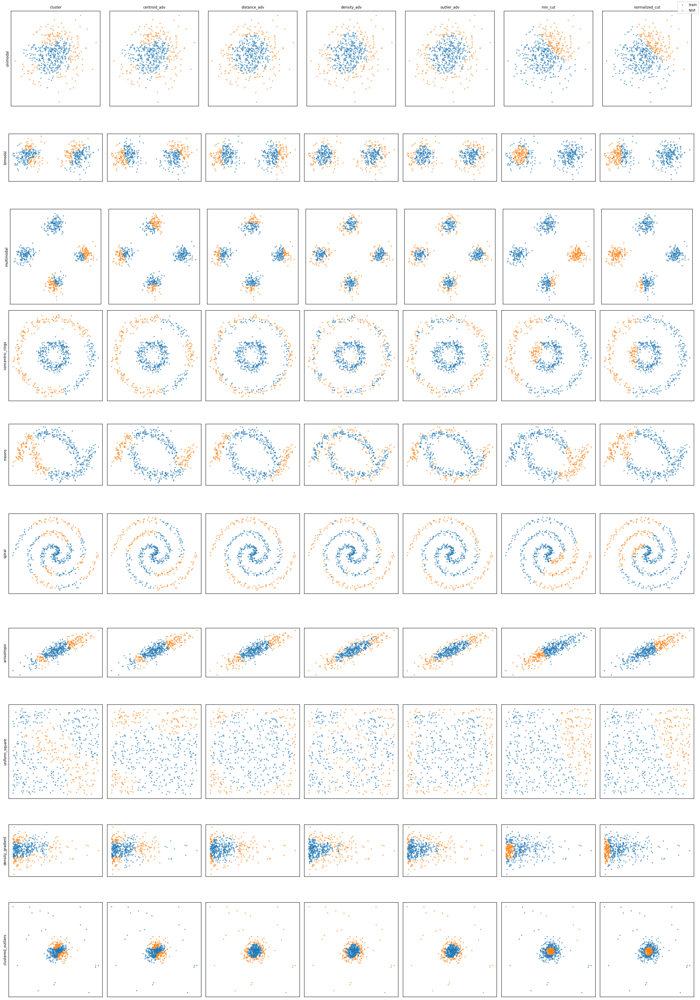
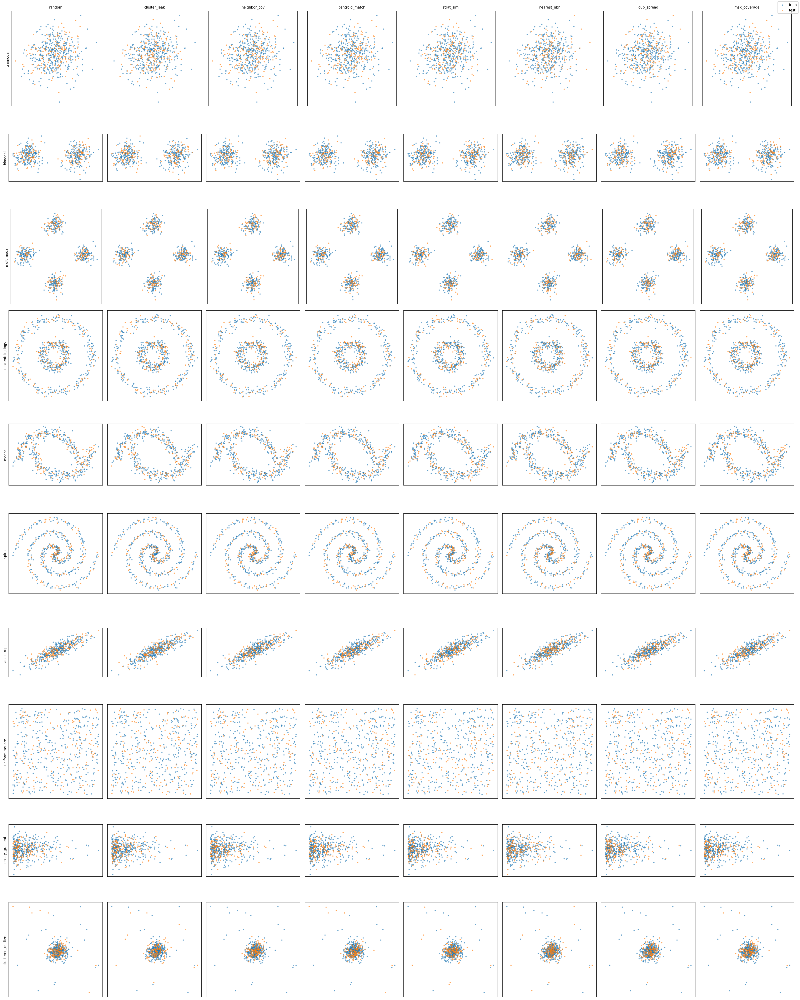
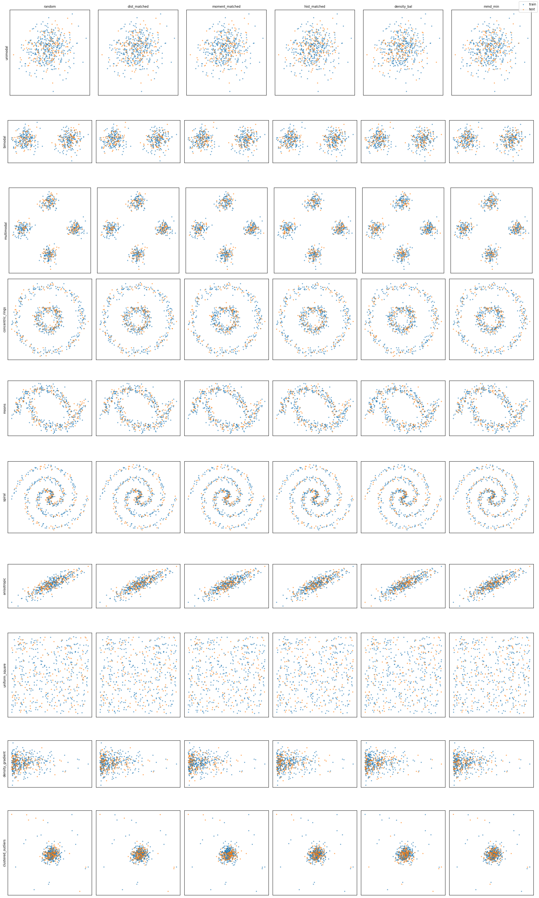

# splytters

Train/test splitting algorithms for dataset partitioning — beyond random splits.

A random split tells you how a model performs on data that looks just like its training set. Often that's not the question you're asking. This library provides splitters with three different objectives:

| Objective | Package module | What it does | Use it for |
|---|---|---|---|
| **Adversarial** | `splitters.adversarial` | Minimize train/test similarity | Hard evaluation — measure generalization to unfamiliar data |
| **Overlap** | `splitters.overlap` | Maximize train/test similarity | Easy evaluation — sanity checks, debugging, upper-bound estimates |
| **Balanced** | `splitters.balanced` | Match train/test distributions | Fair evaluation — avoid accidental distribution shift |

All splitters operate on embeddings (any `(n_samples, dim)` array) and return index lists, so they work with any data you can embed: text, images, audio, tabular rows.

## Quickstart

```python
import numpy as np
from splitters import cluster_split

embeddings = np.random.rand(500, 384)  # your embeddings here

train_idx, test_idx = cluster_split(embeddings, train_ratio=0.7)
```

Every splitter follows the same interface:

```python
train_indices, test_indices = some_split(
    embeddings,        # (n_samples, embedding_dim) array-like
    train_ratio=0.7,
    random_state=42,
)
```

A more realistic example with text:

```python
from sentence_transformers import SentenceTransformer
from splitters import centroid_adversarial_split

texts = [...]  # your dataset
embeddings = SentenceTransformer("all-MiniLM-L6-v2").encode(texts)

train_idx, test_idx = centroid_adversarial_split(embeddings, train_ratio=0.7)
train = [texts[i] for i in train_idx]
test = [texts[i] for i in test_idx]
```

## Available splitters

**Adversarial** (minimize train/test similarity):
`cluster_split`, `centroid_adversarial_split`, `distance_adversarial_split`, `density_adversarial_split`, `outlier_adversarial_split`, `min_cut_split`, `normalized_cut_split`



**Overlap** (maximize train/test similarity):
`cluster_leak_split`, `neighbor_coverage_split`, `centroid_matched_split`, `stratified_similarity_split`, `nearest_neighbor_split`, `duplicate_spread_split`, `max_coverage_split`



**Balanced** (match train/test distributions):
`distribution_matched_split`, `moment_matched_split`, `histogram_matched_split`, `stratified_random_split`, `density_balanced_split`, `mmd_minimized_split`



A plain `random_split` baseline and utilities (`compute_pairwise_distances`, `compute_split_similarity`, `cluster_embeddings`, ...) are also exported from `splitters`.

The figures above are generated by `visualize_splits.py` — each row is a 2D distribution (unimodal, moons, spirals, rings, ...), each column a splitter. Blue = train, orange = test.

## Sorters

The companion `sorters` package ranks samples by interpretable difficulty/quality metrics — useful for curriculum-style splits ("train on easy, test on hard") or just inspecting your data:

- **`embedding_sorters`** — `distance_to_mean`, `distance_to_nearest_neighbor`, `local_density`, `outlier_score`
- **`text_sorters`** — length, readability, perplexity, lexical diversity, vocabulary rarity, sentence count
- **`image_sorters`** — brightness, contrast, color variance, compression ratio, frequency content
- **`audio_sorters`** — loudness, spectral features, MFCCs, rhythm, quality metrics
- **`tabular_sorters`** — column- and row-level metrics, categorical handling, multi-column sorting

```python
from sorters import distance_to_mean

ranked = distance_to_mean(embeddings)  # most typical → most atypical
```

See `demo.py` for sorters on a real dataset (TREC questions), and `demo/visualize_text_splits.py` for splitters on embedded text projected to 2D.

## Installation

Clone and install dependencies:

```bash
git clone https://github.com/gxlarson/splytters
cd splytters
pip install numpy scipy scikit-learn
```

Optional extras, depending on which sorters/demos you use:

- text sorters: `torch`, `transformers`, `readability`, `wordfreq`, `pysbd`
- audio sorters: `librosa`
- image sorters: `Pillow`
- demos: `sentence-transformers`, `datasets`, `matplotlib`, `umap-learn`

## Tests

```bash
pytest
```

## Project layout

```
splitters/        # splitting algorithms (adversarial, overlap, balanced, utils)
sorters/          # ranking metrics (text, image, audio, embedding, tabular)
tests/            # pytest suite
test_data/        # sample audio/images/text used by tests
demo.py           # sorters demo on TREC
demo/             # splitter visualizations on embedded text
docs/             # README figures
visualize_splits.py   # generates the figures above
```
