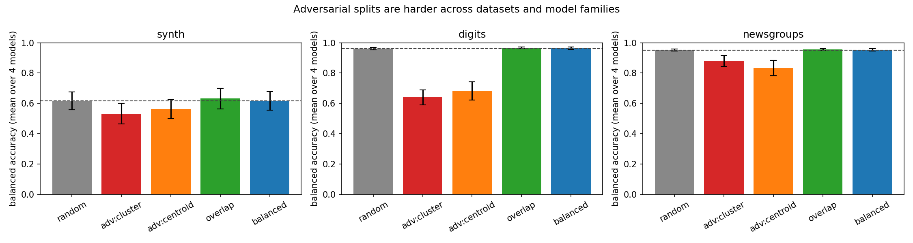

# splytters: Clustering-based Data Splits for Model Robustness Testing

*Draft system-demonstration paper (target: ACL/EMNLP System Demonstrations,
JMLR-MLOSS, or a NeurIPS/ICLR workshop). ~4 pages when formatted.*

**Author:** Stefan Larson (Vanderbilt University) · *and contributors*

---

## Abstract

A random train/test split measures how a model performs on data that looks just
like its training set — often not the question we are actually asking. `splytters`
is an open-source Python library of embedding-based splitting algorithms with
three explicit objectives: **adversarial** (minimize train/test similarity, for
hard generalization tests), **overlap** (maximize similarity, for sanity checks
and upper bounds), and **balanced** (match distributions, for fair evaluation
without accidental shift). The library exposes a single scikit-learn-style
interface, integrates with the scikit-learn cross-validation protocol, pandas,
PyTorch, and HuggingFace `datasets`, and ships a `split_report` that quantifies
how adversarial/overlapping/balanced a produced split actually is. Across three
datasets (synthetic, vision, and real text) and four model families, adversarial
splits make the *same model and data* measurably harder — with no class ever
dropped from training — while overlap and balanced track a random split; on a
controlled benchmark where features are decorrelated from labels the effect is
purely covariate shift (×20 feature distance). The split-quality report further
predicts realized difficulty *without training a model* (Spearman ρ = 0.65). A
single random split can thus badly misestimate generalization.

## 1 Introduction

Standard practice evaluates models on a uniformly random held-out split (or
*k*-fold CV). Because random splitting places near-duplicate and otherwise
similar examples on both sides of the boundary, it tends to **over-estimate**
generalization: the test set is, in effect, partly memorizable from the training
set (Gorman and Bedrick, 2019; Søgaard et al., 2021). When the question is "how
well does this model generalize to *unfamiliar* data?", we instead want a test
set that is deliberately *dissimilar* from training; when the question is "is my
pipeline wired up correctly?", we may want a deliberately *easy* split; and when
we want a fair comparison, we want train and test to be distributionally
*matched*.

`splytters` makes the splitting objective a first-class, swappable choice.

## 2 The library

### 2.1 Three objectives, one interface

All splitters operate on embeddings (any `(n_samples, dim)` array) and return a
pair of integer index arrays that partition the dataset:

```python
train_idx, test_idx = some_split(embeddings, train_size=0.7, random_state=42)
```

| Objective | Module | Goal | Representative splitters |
|---|---|---|---|
| Adversarial | `splitters.adversarial` | minimize train/test similarity | `cluster_split`, `centroid_adversarial_split`, `min_cut_split`, `normalized_cut_split`, `wasserstein_adversarial_split` |
| Overlap | `splitters.overlap` | maximize train/test similarity | `cluster_leak_split`, `nearest_neighbor_split`, `max_coverage_split` |
| Balanced | `splitters.balanced` | match distributions | `distribution_matched_split`, `mmd_minimized_split`, `moment_matched_split` |

`wasserstein_adversarial_split` implements the Wasserstein nearest-neighbor
construction of Søgaard et al. (2021): treating each embedding as a 1-D
distribution, the test set is the neighborhood (in earth-mover distance) of a
random anchor.

### 2.2 Ecosystem integration

The functional core is wrapped for the ecosystems practitioners already use:

- **scikit-learn.** `SplytterSplit` is a `BaseCrossValidator` (`split`/
  `get_n_splits`) usable directly as `cv=` in `cross_validate`/`GridSearchCV`;
  `adversarial_/overlap_/balanced_train_test_split` are drop-in replacements for
  `train_test_split` that slice every passed array consistently.
- **pandas / PyTorch / HuggingFace** `split_dataframe`, `to_torch_subsets`, and
  `split_dataset` return native `DataFrame`s, `torch.utils.data.Subset`s, and a
  `DatasetDict`. Splitters also accept torch tensors (CPU/GPU) directly.

Heavy dependencies are imported lazily, so `import splitters`/`import sorters`
require nothing beyond numpy/scipy/scikit-learn, and each optional extra is
self-sufficient.

### 2.3 Sorters

A companion `sorters` package ranks samples by interpretable per-modality
difficulty/quality metrics (text length/readability/perplexity, image
brightness/contrast/frequency, audio spectral/rhythm features, tabular
column/row statistics, embedding distance/density/outlier scores) — useful for
curriculum-style "train on easy, test on hard" splits and for inspecting data.

### 2.4 Measuring a split: `split_report`

`split_report(embeddings, train_idx, test_idx, y=None)` returns a single
interpretable record combining geometric separation (centroid distance,
nearest-train distance, neighbor coverage), cluster leakage, and distribution
distances — RBF-MMD, energy distance, mean 1-D Wasserstein and KS — plus an
optional label-distribution shift. `compare_splitters` tabulates these across a
set of splitters in one call.

## 3 Implementation

Inputs are validated and coerced through scikit-learn's `check_array` (rejecting
NaN/inf and non-2-D inputs with clear errors); `random_state` follows
`check_random_state` (int / `RandomState` / `None`). Outputs are integer
`ndarray`s. The package is typed, NumPy-style-documented, and covered by a
pytest suite (≈300 tests) run in CI on Python 3.10–3.12. Several distance-based
splitters currently materialize a full pairwise matrix (acknowledged in-code);
an approximate-nearest-neighbor backend (`[ann]` extra) is the path to scale,
and is the main item of ongoing work.

## 4 Illustrative experiment

**Question.** Does the split *objective* change measured difficulty for a fixed
model and dataset — and is any such effect genuine covariate shift rather than a
class-coverage artifact? For each objective we build a 70/30 split with the
representative splitter, train logistic regression on the training embeddings,
and score the held-out embeddings over 10 seeds, reporting *raw* and *balanced*
accuracy, the fraction of classes missing from training, and the
label-distribution shift and energy distance from `split_report`.

**Controlled benchmark (the clean test).** A synthetic 4-class problem
(`make_classification`, 1,500×20) with three feature clusters *per class*, so
feature geometry is deliberately decorrelated from labels and a feature-based
adversarial split cannot remove or skew a class:

| Split objective | raw acc | balanced acc | missing classes | label shift | energy |
|---|---|---|---|---|---|
| random | 0.547 | 0.547 | 0.0 | 0.03 | 0.020 |
| **adversarial** | **0.439** | **0.445** | **0.0** | **0.19** | 0.405 |
| overlap | 0.554 | 0.556 | 0.0 | 0.04 | 0.018 |
| balanced | 0.550 | 0.550 | 0.0 | 0.03 | 0.011 |

With **no classes missing** and **small label shift**, the adversarial split
still loses ~9 balanced-accuracy points while feature energy distance rises
**×20** — genuine covariate shift, not coverage. Overlap and balanced match
random and minimize the distribution distances, exactly as designed.

**Breadth: three datasets × four model families.** We repeat the protocol on the
controlled `synth` set, `sklearn`'s `digits` (1,797×64 images), and a real-text
task — four 20-Newsgroups categories (1,600 posts) embedded with a
sentence-transformer — and sweep four classifiers (logistic regression, random
forest, linear SVM, k-NN). Mean balanced accuracy over the four models:

| split | synth | digits | newsgroups | label shift | classes missing |
|---|---|---|---|---|---|
| random | 0.617 | 0.962 | 0.952 | ≤0.06 | 0.0 |
| **adversarial (cluster)** | **0.532** | **0.640** | **0.880** | 0.19–0.71 | 0.0 |
| **adversarial (centroid)** | **0.562** | **0.682** | **0.833** | 0.25–0.80 | 0.0 |
| overlap | 0.632 | 0.967 | 0.955 | ≤0.04 | 0.0 |
| balanced | 0.617 | 0.963 | 0.954 | ≤0.04 | 0.0 |



Adversarial splits are harder than random on **every** dataset and for **every**
model family (no class ever drops out of training), while overlap and balanced
track the random baseline — the objectives behave as specified regardless of
downstream model. The effect is largest where it can compound with label skew
(`digits`) and smallest on the already-easy text task, but its sign and ordering
are invariant.

**`split_report` predicts difficulty without training.** Across all 300
(dataset × split × model × seed) runs, the report's geometric **energy distance**
correlates with the realized balanced-accuracy drop relative to random at
**Spearman ρ = 0.65 (p ≈ 2.5×10⁻¹⁰)** — so a practitioner can estimate how hard a
split is, and compare splitters, *before* training anything. Reproduce with
`make figures` (the per-dataset bars + the controlled study) or
`python experiments/validate.py` (the full model sweep; fixed seeds).

## 5 Related work

Gorman and Bedrick (2019) and Søgaard et al. (2021) argue that standard/random
splits over-estimate performance and advocate dissimilarity-aware splits;
`splytters` operationalizes these ideas as a reusable, framework-integrated
library spanning adversarial, overlap, and balanced objectives, and adds split
diagnostics. scikit-learn provides `GroupKFold`/`StratifiedKFold` for grouping
and stratification but no embedding-similarity-based or distribution-matching
splitters.

## 6 Availability

MIT-licensed at <https://github.com/gxlarson/splytters> (`pip install splytters`).
CI runs the suite on Python 3.10–3.12; a tagged release will be archived on
Zenodo for a citable DOI (see `CITATION.cff`).

## 7 Limitations and future work

Several graph/coverage splitters are O(n²) in memory (ANN backend in progress);
distribution-matching splitters use stochastic swap optimization without global
guarantees; the experiments here are two offline datasets (one controlled),
intended as motivation rather than a benchmark study — a multi-dataset,
multi-model evaluation (text + vision), reporting balanced accuracy and the
covariate-vs-coverage decomposition throughout, is the natural follow-on.

## References

- Gorman, K., and Bedrick, S. (2019). *We Need to Talk about Standard Splits.* ACL.
- Søgaard, A., Ebert, S., Bastings, J., and Filippova, K. (2021). *We Need to
  Talk About Random Splits.* EACL. https://aclanthology.org/2021.eacl-main.156
- *[TODO: finalize the Computational Linguistics reference cited in the original
  proposal, https://aclanthology.org/J15-3006, and the diversity reference
  https://aclanthology.org/N19-1051 used by `metrics.diversity_text`.]*
